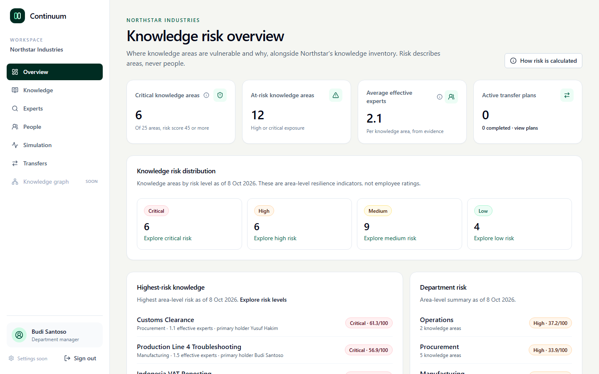
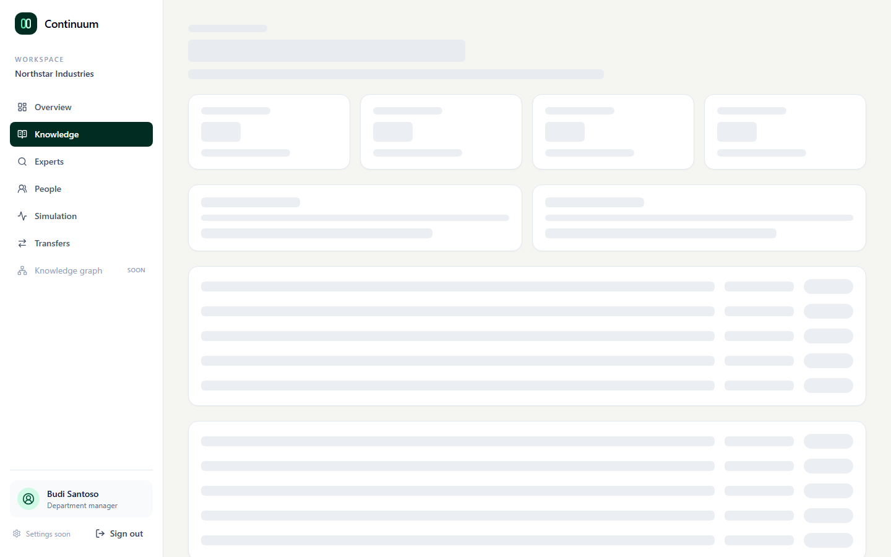
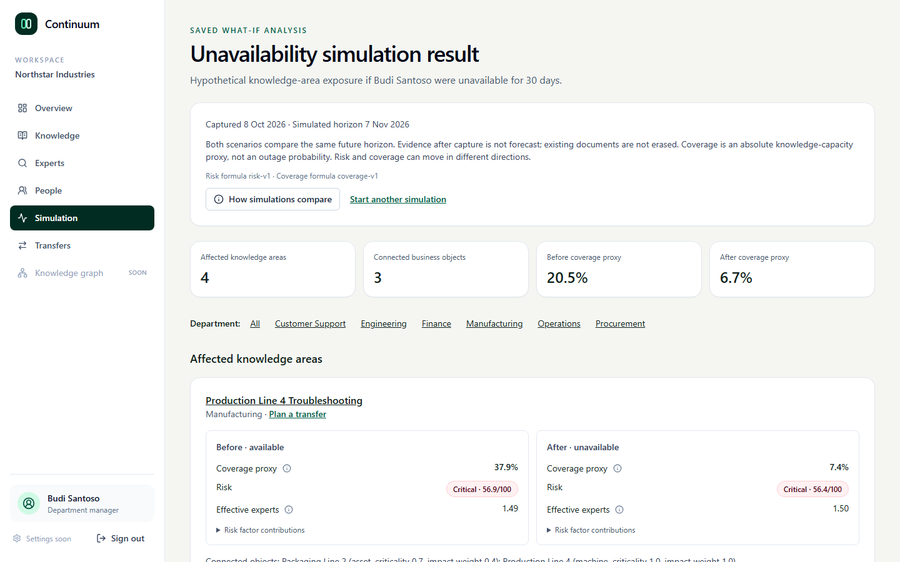
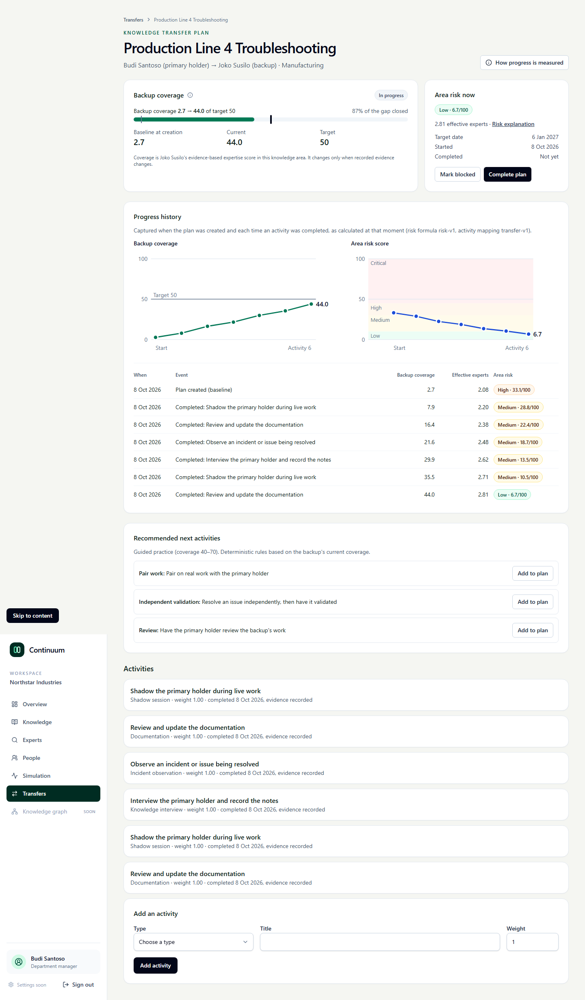
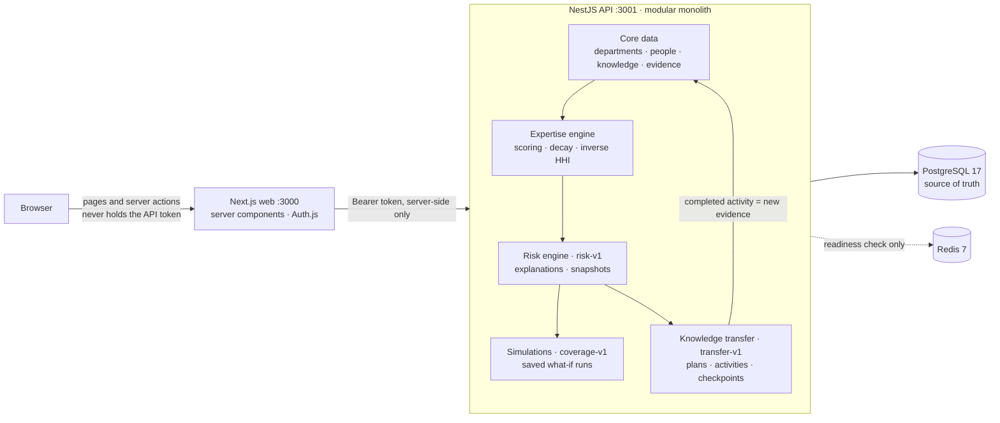

# Continuum

Continuum is an internal organizational knowledge resilience platform. It helps an organization understand where critical knowledge lives, detect dangerous concentration, simulate key-person unavailability, and build measurable backup expertise.

The product evaluates the resilience of **knowledge areas**, not employee performance.

## The Problem

Organizations often depend on knowledge held by a small number of people. When one of them is away, the process they understand slows down or stops, and nobody notices the dependency until it fails.

## Product Hypothesis

Organizations can reduce operational risk by continuously measuring knowledge concentration and deliberately building backup expertise. Continuum answers four questions:

1. **Who knows this?** Evidence-based expertise per knowledge area, with every score traceable to its evidence.
2. **How dependent are we on them?** Effective expert count and an explainable risk score per area.
3. **What happens if they are unavailable?** A saved, same-horizon what-if simulation.
4. **What should we do about it?** Transfer plans whose progress is measured with new evidence, not claimed.

## Screenshots

| Risk overview                                                                                          | Explainable area risk                                                                     |
| ------------------------------------------------------------------------------------------------------ | ----------------------------------------------------------------------------------------- |
|  |              |
| **Unavailability simulation**                                                                          | **Transfer progress: CRITICAL → HIGH → LOW**                                              |
|                                 |  |

The [explanation drawer](docs/screenshots/03-explanation-drawer.png), [evidence](docs/screenshots/04-evidence.png), [Expert Finder](docs/screenshots/05-expert-finder.png), [375-pixel transfer view](docs/screenshots/08-transfer-mobile.png), and [dashboard after the transfers](docs/screenshots/09-dashboard-after.png) complete the demo path.

## Demo Walkthrough

Sign in as `manager@northstar.demo` (see [Demo Accounts](#demo-accounts)) on a fresh stack and follow the flagship flow from spec section 49. Live scores age with the calendar because the seed evidence is dated from 2026-09-01; the figures below were observed on 2026-10-08.

1. **Overview.** Several knowledge areas are critical (six on 2026-10-08). Production Line 4 Troubleshooting is one of them, and its primary holder is Budi Santoso.
2. **Knowledge → Production Line 4.** The risk is Critical (56.9) with 1.5 effective experts. Use **How these figures work** for the formula and the evidence table for traceability.
3. **Experts.** Search "line 4" to see who holds the knowledge and why.
4. **Simulation.** Simulate Budi unavailable for 30 days. Line 4 coverage falls from about 38% to 7%.
5. **Plan a transfer** from the Line 4 result. Choose Andri as backup and add and complete the recommended activities. Andri's coverage rises from 18 to over 70, and Line 4 drops from Critical to High.
6. **Complete the plan, then start a second plan for Joko.** As three people now hold the knowledge, Line 4 reaches Low.

Completing activities appends evidence. Return to the seed state before and after a demo with `pnpm db:reset --yes` (see [Database Workflows](#database-workflows)). The whole path is automated as an opt-in Playwright run that resets the database before and after and regenerates the screenshots above:

```bash
RUN_PORTFOLIO_DEMO=1 WALKTHROUGH_OUTPUT_DIR="$(pwd)/docs/screenshots" \
  pnpm --filter @continuum/web exec playwright test portfolio-demo.manual.spec.ts --workers=1
```

## Main Technical Concepts

- **Expertise scoring.** Each evidence record contributes `type weight × strength × recency`. Variety across up to five evidence types adds up to 30%, and a global scale maps the result to 0–100. Weights are configurable defaults; see [`docs/DEVELOPMENT_PHASES.md`](docs/DEVELOPMENT_PHASES.md) for the calibration.
- **Knowledge decay.** Recency uses inclusive day bands (0–90, 91–180, 181–365, 366–730, older), softened per area by its decay rate, against an explicit `asOf` date for reproducible results.
- **Effective expert count.** The inverse Herfindahl–Hirschman index of unrounded contributions: one holder gives 1, three equal holders give 3. It measures how evenly knowledge is spread, not headcount.
- **Knowledge concentration.** Concentration is `(3 − effective experts) ÷ 2`, clamped to 0–1. Zero holders and one holder are both maximally concentrated.
- **Risk calculation (`risk-v1`).** `100 × criticality × (0.75 × concentration + 0.15 × freshness + 0.10 × documentation gap)`, with levels Low < 10 ≤ Medium < 30 ≤ High < 45 ≤ Critical. Every factor and its weighted points are returned so the interface never reimplements the formula, and captured snapshots record the inputs as calculated then.
- **Simulation engine (`coverage-v1`).**
  - It compares the same future horizon with and without one person, using only evidence that existed at capture; their past documents still count.
  - Coverage is an absolute capacity proxy, the capped sum of holders' scores over three experts.
  - Because effective experts is relative, removing a dominant holder can cut coverage sharply while the risk score barely moves, so both are shown.
- **Transfer measurement (`transfer-v1`).**
  - A completed activity becomes one traceable evidence record for the backup.
  - Coverage and risk then change only through the formulas above.
  - Each plan stores checkpoints as calculated at each step, so the progress charts show measured, not claimed, improvement.

## Development Status

Phase 1, the platform foundation, is complete. Its full container acceptance passed on 2026-09-27. The implementation includes:

- a pnpm and Turborepo monorepo;
- a Next.js web application and NestJS REST API;
- PostgreSQL with committed Prisma migrations;
- Redis connectivity and readiness checks;
- Auth.js credentials authentication with three demo roles;
- an idempotent authentication seed;
- production-oriented Docker images and Docker Compose orchestration;
- an accessible, responsive sign-in experience and protected application shell.

Phase 2, core data, is complete. Its full acceptance passed on 2026-09-27. It adds:

- departments, employees, knowledge areas, business objects, their links, and evidence in PostgreSQL;
- a deterministic synthetic dataset for Northstar Industries: 35 people, 25 knowledge areas, 12 business objects, and 186 evidence records;
- read-only, validated, paginated REST resources for every core entity;
- an inventory dashboard, a searchable knowledge explorer, knowledge area detail pages with evidence, and a people directory with profiles.

Phase 3, the expertise engine, is complete. It adds evidence-weighted, recency-aware expertise scores, confidence labels, effective expert counts (inverse HHI), and an Expert Finder. Knowledge detail and people profiles show expertise in the context of individual knowledge areas, with traceable evidence. See [`docs/testing/PHASE_3_TEST_CASES.md`](docs/testing/PHASE_3_TEST_CASES.md) for its acceptance evidence.

Phase 4, the risk engine, is complete. The API calculates knowledge-area exposure from business criticality, effective-expert concentration, evidence freshness, and documentation gaps. Protected dashboard and knowledge endpoints feed risk distribution, department summaries, ranked knowledge, server-calculated factor contributions, and a conditional snapshot history on the knowledge detail page. A knowledge administrator can explicitly capture a dated, versioned snapshot with `POST /api/v1/knowledge/:id/risk/snapshots`; ordinary GETs never create snapshots, and a captured date cannot be backdated. Existing snapshots are available through paginated GET at the same path. Automated regression, local visual/keyboard/outage walkthrough, and acceptance-owner screenshot review passed; see [`docs/DEVELOPMENT_PHASES.md`](docs/DEVELOPMENT_PHASES.md) and [`docs/testing/PHASE_4_TEST_CASES.md`](docs/testing/PHASE_4_TEST_CASES.md).

Phase 5, unavailability simulation, is complete. A manager or knowledge admin can explicitly save a hypothetical run with `POST /api/v1/simulations/unavailability` and revisit their saved result with `GET /api/v1/simulations/:id` (admins can also read runs); ordinary employees cannot create runs. The `/simulate` page compares knowledge-area risk and coverage with and without one active employee at the same future horizon, with linked business objects. Existing evidence and documents are not deleted, and GET never recalculates or writes a run. Unit, migration, API integration, browser, and visual/outage acceptance passed on a rebuilt Compose stack, and the acceptance owner approved the screenshots. See [`docs/testing/PHASE_5_TEST_CASES.md`](docs/testing/PHASE_5_TEST_CASES.md).

Phase 6, knowledge transfer, is complete; the acceptance owner approved its screenshots on 2026-10-08. Managers and knowledge admins plan backup coverage at `/transfers`: choose a knowledge area, its primary holder, a backup, a target coverage, and a date. They then add deterministic, recommended activities and complete them. Each completed activity records one traceable evidence row for the backup, so expertise, effective expert count, and risk change only through the existing Phase 3 and Phase 4 engines. Each plan keeps a dated progress history. With the seed data, a Budi → Andri plan takes Production Line 4 from CRITICAL to HIGH, and a second Budi → Joko plan takes it to LOW. Every role can read plans; only managers and knowledge admins change them. See [`docs/testing/PHASE_6_TEST_CASES.md`](docs/testing/PHASE_6_TEST_CASES.md).

Phase 7, product polish, is implemented and awaiting acceptance-owner screenshot sign-off. It adds:

- dashboard cards for critical and at-risk areas, average effective experts, and active transfer plans;
- primary holders on the highest-risk list;
- server-rendered SVG charts for transfer progress and captured risk history;
- explanation drawers and keyboard-accessible definitions;
- page-shaped loading skeletons;
- this README's concepts, diagram, demo walkthrough, and screenshots.

No formula changed. See [`docs/testing/PHASE_7_TEST_CASES.md`](docs/testing/PHASE_7_TEST_CASES.md).

## Architecture



The API is a modular monolith whose formula modules (expertise, risk, simulation, transfer) are framework-independent and versioned. PostgreSQL is the source of truth. Redis is verified by readiness checks and reserved for a future queue or cache; no BullMQ worker exists, because recalculation stays fast on demand at this scale. Next.js never connects to the database and never exposes the API token to the browser.

Read [`docs/ARCHITECTURE.md`](docs/ARCHITECTURE.md) for component boundaries, authentication flow, and startup sequencing.

## Prerequisites

For the recommended Docker workflow:

- Docker Desktop with Docker Compose v2

For native application development:

- Node.js 22.12 or newer
- pnpm 10.17.x through Corepack
- Docker Desktop for PostgreSQL and Redis

## Quick Start

Create a local environment file:

```powershell
Copy-Item .env.example .env
```

Start the complete stack:

```bash
docker compose up --build
```

The first startup builds both applications, waits for PostgreSQL, applies committed migrations, runs the idempotent seed (demo accounts plus the Northstar dataset), waits for Redis, and then starts the API and web application.

Open:

| Service           | URL                                       |
| ----------------- | ----------------------------------------- |
| Web application   | http://localhost:3000                     |
| API documentation | http://localhost:3001/docs                |
| API liveness      | http://localhost:3001/api/v1/health/live  |
| API readiness     | http://localhost:3001/api/v1/health/ready |

Stop the stack with:

```bash
docker compose down
```

## Demo Accounts

All seeded accounts use the password configured by `DEMO_USER_PASSWORD`. The development default is `ContinuumDemo123!`.

| Role                    | Email                     |
| ----------------------- | ------------------------- |
| Employee                | `employee@northstar.demo` |
| Department manager      | `manager@northstar.demo`  |
| Knowledge administrator | `admin@northstar.demo`    |

The default credentials are development-only. Replace every secret in `.env` before deploying outside a local machine and set `SHOW_DEMO_CREDENTIALS=false`.

## Native Development

Enable the package manager declared in `package.json`:

```bash
corepack enable
corepack prepare pnpm@10.17.1 --activate
```

If the machine prevents Corepack from writing global shims, use `npx --yes pnpm@10.17.1 <command>` for root Turborepo commands, or install pnpm 10.17.x through the platform's package manager.

Install dependencies:

```bash
pnpm install --frozen-lockfile
```

Create application environment files:

```powershell
Copy-Item apps/api/.env.example apps/api/.env
Copy-Item apps/web/.env.example apps/web/.env.local
```

Start only the backing services:

```bash
docker compose up -d postgres redis
```

Apply the migration and seed:

```bash
pnpm db:migrate
pnpm db:seed
```

Start both applications in watch mode:

```bash
pnpm dev
```

## Quality Commands

```bash
pnpm lint
pnpm typecheck
pnpm test
pnpm build
```

Run the full local regression gate with:

```bash
pnpm check
```

API integration and browser tests run against a running, seeded stack such as `docker compose up`:

```bash
pnpm --filter @continuum/web exec playwright install chromium   # once per machine
pnpm test:integration
pnpm test:e2e
```

They default to `http://localhost:3001/api/v1` and `http://localhost:3000`; override them with `API_BASE_URL` and `E2E_BASE_URL`. Both sign in with `DEMO_USER_PASSWORD` or `E2E_PASSWORD`, which default to the development password.

Phase-specific manual and automated acceptance cases are documented in [`docs/testing/PHASE_1_TEST_CASES.md`](docs/testing/PHASE_1_TEST_CASES.md), [`docs/testing/PHASE_2_TEST_CASES.md`](docs/testing/PHASE_2_TEST_CASES.md), [`docs/testing/PHASE_3_TEST_CASES.md`](docs/testing/PHASE_3_TEST_CASES.md), [`docs/testing/PHASE_4_TEST_CASES.md`](docs/testing/PHASE_4_TEST_CASES.md), [`docs/testing/PHASE_5_TEST_CASES.md`](docs/testing/PHASE_5_TEST_CASES.md), and [`docs/testing/PHASE_6_TEST_CASES.md`](docs/testing/PHASE_6_TEST_CASES.md).

## Database Workflows

Generate Prisma Client after changing the schema:

```bash
pnpm db:generate
```

Create a development migration:

```bash
pnpm db:migrate
```

Re-run the idempotent seed:

```bash
pnpm db:seed
```

The seed upserts records by stable IDs such as `ka_line4_troubleshooting` and never deletes data. Evidence dates are fixed offsets from `2026-09-01`, so repeated runs write identical rows. The dataset lives in `apps/api/prisma/seed-data/northstar.ts`.

Completed transfer activities append evidence. To return the demo database to the seed state, deleting transfer plans, simulation runs, risk snapshots, and every non-seed evidence record, run the explicit reset. It refuses to run without `--yes` and never runs at startup:

```bash
pnpm db:reset --yes
# or, against the Compose database:
docker compose run --rm --no-deps seed pnpm --filter @continuum/api db:reset --yes
```

Reset all local Compose data, including volumes, only when a destructive reset is intended:

```bash
pnpm compose:reset
docker compose up --build
```

## Repository Layout

```text
continuum/
|-- apps/
|   |-- api/                  NestJS API, Prisma schema, migrations, seed, and integration tests
|   `-- web/                  Next.js application, shadcn/ui primitives, and Playwright tests
|-- docs/
|   |-- ARCHITECTURE.md
|   |-- DEVELOPMENT_PHASES.md
|   |-- screenshots/          README screenshots from the portfolio demo run
|   `-- testing/
|       |-- PHASE_1_TEST_CASES.md
|       |-- PHASE_2_TEST_CASES.md
|       |-- PHASE_3_TEST_CASES.md
|       |-- PHASE_4_TEST_CASES.md
|       |-- PHASE_5_TEST_CASES.md
|       |-- PHASE_6_TEST_CASES.md
|       `-- PHASE_7_TEST_CASES.md
|-- AGENTS.md                 Contributor and coding-agent guardrails
|-- docker-compose.yml
|-- pnpm-workspace.yaml
`-- turbo.json
```

## Product Principles

- Evaluate knowledge resilience, never employee productivity.
- Derive expertise from traceable evidence.
- Keep every score deterministic and explainable.
- Collect the minimum data needed for organizational risk analysis.
- Prefer a modular monolith and testable domain services over premature infrastructure.

The complete product brief remains the source of truth in [`continuum_project_spec.md`](continuum_project_spec.md).
